# Module 01 - Create an Azure OpenAI Resource

**[Home](../README.md)** - [Next Module >](./module02.md)

## :loudspeaker: Introduction

In this module, you will learn how to create an Azure OpenAI resource within an Azure subscription and use it to access advanced language models and generative AI capabilities. You can apply these coding and language models to a variety of use cases, such as writing assistance, code generation, and reasoning over data.

## :thinking: Prerequisites

* An [Azure account](https://azure.microsoft.com/free/) with an active subscription. Note: If you don't have access to an Azure subscription, you may be able to start with a [free account](https://www.azure.com/free).
* You must have the necessary privileges within your Azure subscription to create resources and  perform role assignments.
* Access granted to Azure OpenAI in the desired Azure subscription. Note: You can apply for access to Azure OpenAI by completing the form at [https://aka.ms/oai/access](https://aka.ms/oai/access)

## :dart: Objectives

* [ ] Create an Azure OpenAI resource within an Azure subscription via the Azure Portal.
* [ ] View the details of a successfully deployed Azure OpenAI resource.

<a href="#readme">↥ back to top</a>

## 1. Create an Azure OpenAI resource

1. Sign in to the [Azure portal](https://portal.azure.com), navigate to the **Home** screen, click **Create a resource**.

    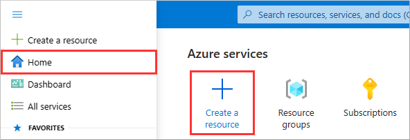

1. Search the Marketplace for `Azure OpenAI`, select the **Azure OpenAI** item in the search results, and click **Create**.

    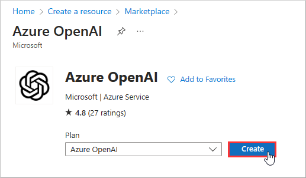

1. Select your target **Subscription** (e.g. `Contoso Subscription`).

    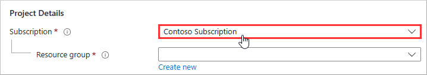

1. Under **Resource group**, click **Create new**.

    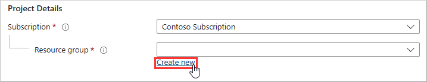

1. Provide the resource group a name (e.g. `oailab`) and click **OK**.

    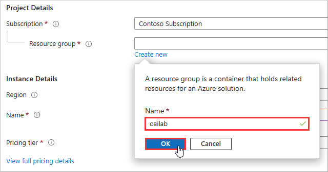

1. Select a **Region** (e.g. `East US`, `South Central US`, or `West Europe`).

    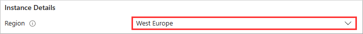

    > Note #1: Azure OpenAI is currently only available in a select number of regions (e.g. `East US`, `South Central US`, and `West Europe`). To check the latest region availability for Azure OpenAI, check the [Azure Products by Region](https://azure.microsoft.com/explore/global-infrastructure/products-by-region/?products=cognitive-services) page.
    >
    > Note #2: Specific models being available for deployment within an Azure OpenAI instance may vary by region. As of 2022-04-12, ChatGPT (`gpt-35-turbo`) is not currently available in West Europe. For more information, refer to [Model Summary table and region availability](https://learn.microsoft.com/azure/cognitive-services/openai/concepts/models#model-summary-table-and-region-availability) section within the Azure OpenAI Service models page.

1. Provide a **Name** (e.g. `oaisvc-{randomID}`).

    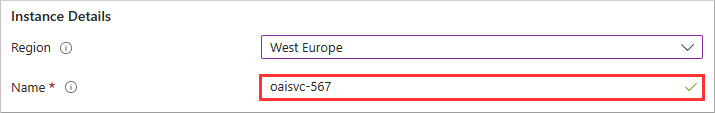

1. Select a **Pricing tier** (e.g. `Standard S0`).

    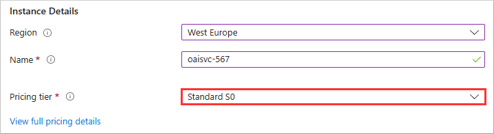

    > Note: As of 2023-04-12, there is only one pricing tier available (`Standard S0`). For the latest information on pricing, check out the [Azure OpenAI Service pricing](https://azure.microsoft.com/pricing/details/cognitive-services/openai-service/) page.

1. Read the **Content review policy** and click **Next**.

    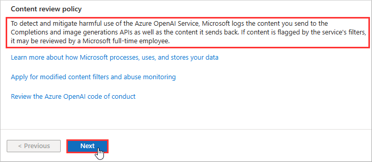

    > :bulb: **Did you know?**
    >
    > To protect the Azure OpenAI Service from harmful use, Microsoft logs the prompts and completions from the service for up to thirty days. If the automated systems flag any content, Microsoft may have authorized employees look at the prompt and completion content to detect and mitigate potential abuse. For more information on how the Azure OpenAI service processes, uses, and stores customer data, check out the [Data, privacy, and security for Azure OpenAI Service](https://learn.microsoft.com/legal/cognitive-services/openai/data-privacy) page.

1. Click **Next**.

    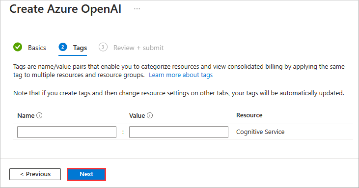

1. Click **Create**.

    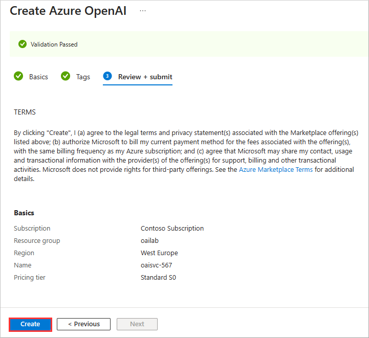

1. Wait several minutes while your deployment is in progress. Once complete, click **Go to resource**.

    > Note: You may need to occasionally click **Refresh** to view the latest status of the deployment.

    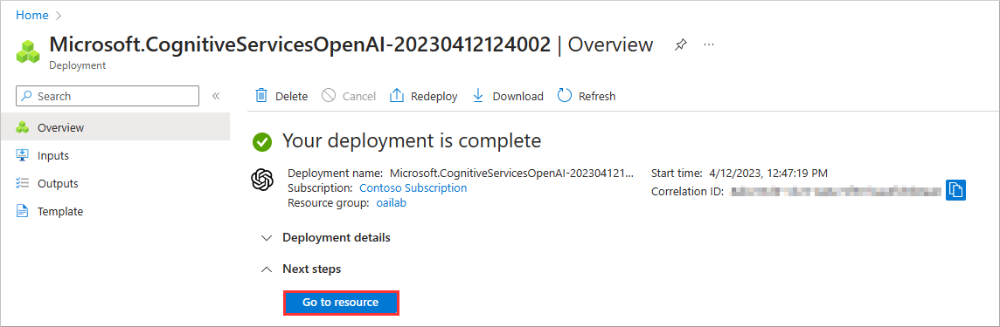

<a href="#readme">↥ back to top</a>

## :mortar_board: Knowledge Check

1. What is the name of the Azure service that you need to search for in the Marketplace to create an Azure OpenAI resource?

    A ) Azure OpenAI  
    B ) Azure Cognitive Services  
    C ) Azure Machine Learning

2. What are some of the regions where Azure OpenAI is currently available?

    A ) East US, South Central US, and West Europe  
    B ) North Europe, Central US, and Antarctica  
    C ) West US, West Canada, and Brazil South

3. How long does Microsoft log the prompts and completions from the Azure OpenAI service for content review purposes?

    A ) Up to seven days  
    B ) Up to thirty days  
    C ) Up to ninety days

<a href="#readme">↥ back to top</a>

## :tada: Summary

You have successfully created an Azure OpenAI resource using the Azure portal.

You have learned how to:

* Search for and select the Azure OpenAI service from the Marketplace.
* Choose a subscription, resource group, region, name, and pricing tier for your resource.
* Create your Azure OpenAI resource and view its details.

By completing this module, you will be able to use Azure OpenAI to generate natural language content with powerful models like GPT-3.

[Continue >](../modules/module02.md)
