# Module 02 - Deploy a Model

[< Previous Module](./module01.md) - **[Home](../README.md)** - [Next Module >](./module03.md)

## :loudspeaker: Introduction

In this module, you will learn how to deploy a model so that you can use the API to get text or inference based on your prompts. When you create a new deployment, you will need to specify which base model you want to deploy.

> Note: You cannot deploy more than one instance of the same model.

## :thinking: Prerequisites

* An [Azure account](https://azure.microsoft.com/free/) with an active subscription.
* An Azure OpenAI resource (see [module 01](./module01.md))
* Sufficient access to deploy a model (e.g. `Owner`, `Contributor`, `Cognitive Services OpenAI Contributor`).

## :dart: Objectives

* [ ] To learn how to deploy a model via Azure OpenAI Studio.
* [ ] To learn how to access the model deployment from the Playground.
* [ ] To learn how to test the model with different inputs and outputs.

<a href="#readme">↥ back to top</a>

## :bookmark_tabs: Table of Contents

| #  | Section |
| --- | --- |
| 1 | [Deploy a Model via Azure OpenAI Studio (Recommended)](#1-deploy-a-model-via-azure-openai-studio-recommended) |
| 2 | [Deploy a Model via the Azure Portal (Optional)](#2-deploy-a-model-via-the-azure-portal-optional) |

<a href="#readme">↥ back to top</a>

## 1. Deploy a Model via Azure OpenAI Studio (Recommended)

1. Navigate to your Azure OpenAI resource instance (e.g. `oaisvc-{randomID}`) and click **Go to Azure OpenAI Studio**.

    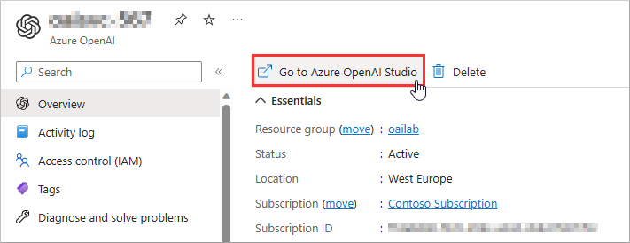

1. Click **Deployments**.

    > Note: Deployments enable you to make calls against a provided base model or your fine-tuned model.

    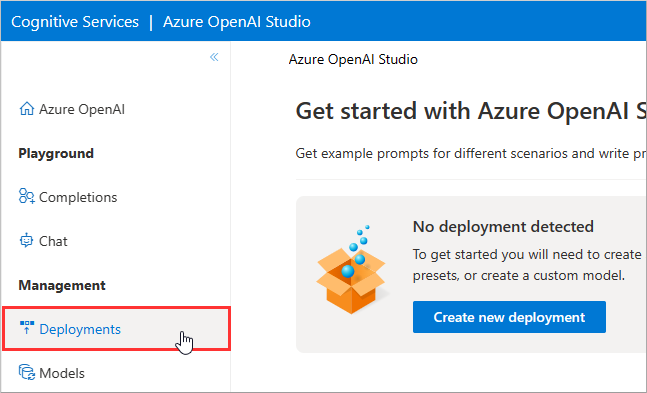

1. Click **Create new deployment**.

    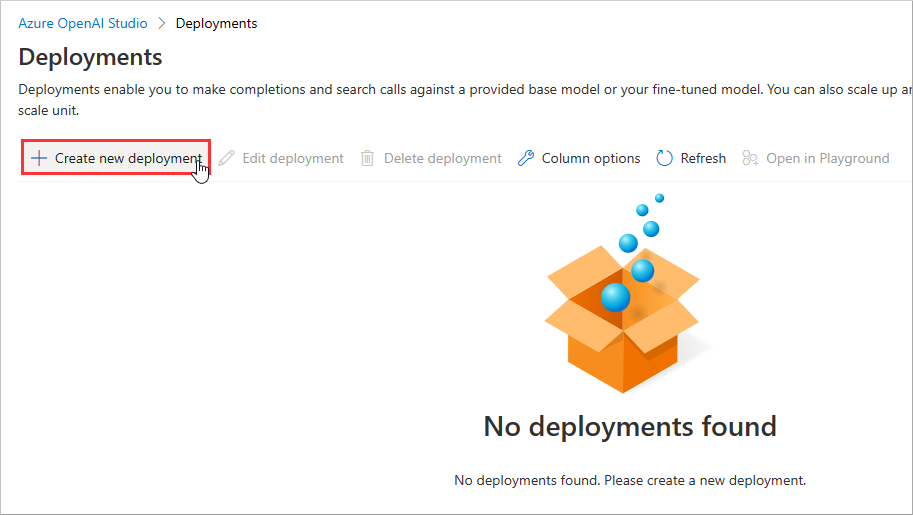

1. Select a **Model** (e.g. `text-davinci-003`).

    > Note: Azure OpenAI provides access to many different models, grouped by family and capability. For more information, check out the [Azure OpenAI Service models](https://learn.microsoft.com/azure/cognitive-services/openai/concepts/models) page.

    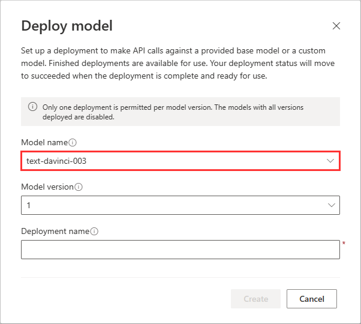

1. Specify a **Model deployment name** (e.g. `my_text_davinci_003`) and click **Create**.

    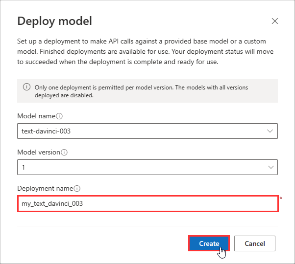

1. Once successfully deployed, select the model and click **Open in Playground**.

    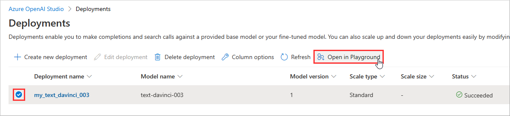

1. To test the model, load an example from the drop-down menu or alternatively, type a prompt within the editable text field (e.g. `What is Azure OpenAI?`), and click **Generate**.

    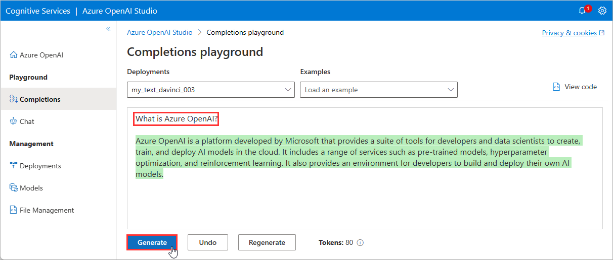

## 2. Deploy a Model via the Azure Portal (Optional)

1. Navigate to your Azure OpenAI resource instance (e.g. `oaisvc-{randomID}`) and click **Model deployments**.

    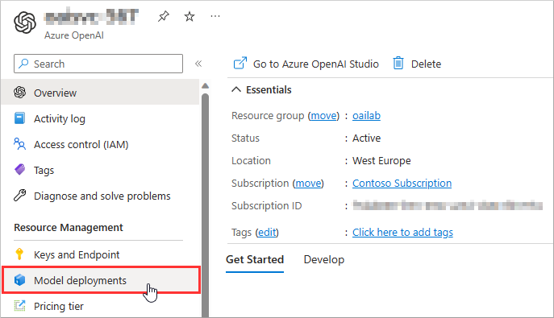

1. Click **Create**.

    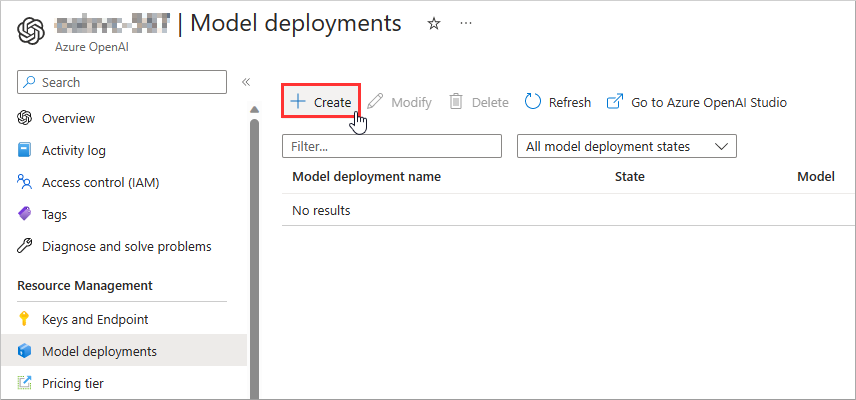

1. Specify a **Model deployment name** (e.g. `my_text_davinci_003`).

    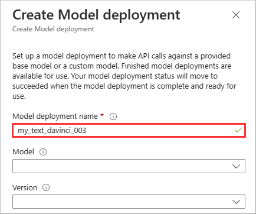

1. Select a **Model** (e.g. `text-davinci-003`).

    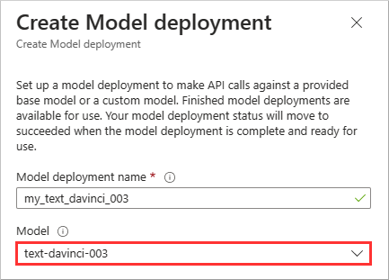

1. Select a **Version** (e.g. `1`).

    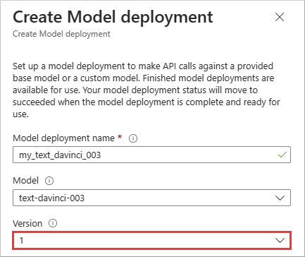

1. Click **Save**.

    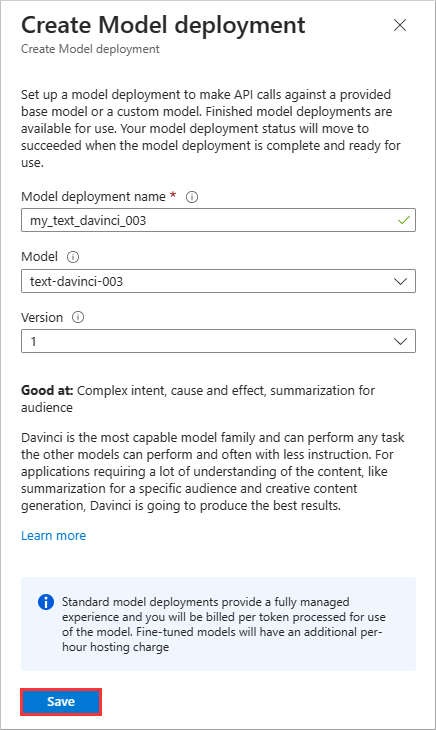

<a href="#readme">↥ back to top</a>

## :mortar_board: Knowledge Check

1. What is a deployment in the context of Azure OpenAI?

    A ) A way to make calls against a base model or a fine-tuned model.  
    B ) A way to train a new model from scratch or fine-tune an existing model.  
    C ) A way to share a model with other users or services.

2. Which of the following attributes is not required to deploy an Azure OpenAI model?

    A ) Model deployment name
    B ) Model family
    C ) Model version

3. Which of the following is a feature that Azure OpenAI Studio has but the Azure Portal does not?

    A ) There is no difference, they are the same.
    B ) Selecting a version of the model.
    C ) Testing the model in the Playground.

<a href="#readme">↥ back to top</a>

## :tada: Summary

You have successfully learned how to deploy an Azure OpenAI model via Azure OpenAI Studio and via the Azure Portal. You have also learned how to test the model in the Playground and how to select different models and versions. You have gained an understanding of what a deployment is and what attributes are required to create one.

[Continue >](../modules/module02.md)
